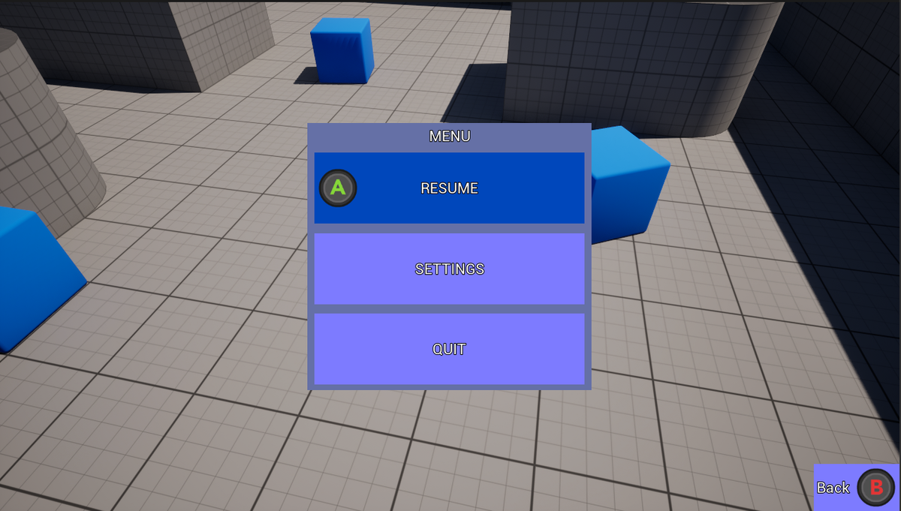

# CommonUITutorial - Integrating CommonUI and Enhanced Input into Gameplay

This project demonstrates how to integrate Unreal Engine's CommonUI plugin with the Enhanced Input system in a gameplay environment. It addresses common challenges such as seamless focus switching between UI and gameplay for both Mouse & Keyboard and Gamepad users.

## Final Result

## Table of Contents

- [Background](#background)
- [Prerequisites](#prerequisites)
- [Key Findings](#key-findings)
- [References](#references)

## Background

Developing UI in Unreal Engine often presents challenges, especially concerning Gamepad support, focus management between widgets, and seamless integration of UI with gameplay. The CommonUI plugin aims to address these issues, but its beta status and evolving documentation can make implementation difficult. This project provides a practical setup for Unreal Engine 5.5, ensuring smooth interaction between CommonUI and Enhanced Input in gameplay scenarios.

## Prerequisites

- Unreal Engine 5.5 installed.
- Basic familiarity with Unreal Engine operations.
- Basic understanding of CommonUI and Enhanced Input systems.

## Key Findings

1. **Widget Activation**: Using `PushWidget` now activates `CommonActivatableWidget` automatically. Manual activation is unnecessary and can disrupt the system.
2. **Input Mode Management**: Avoid using `SetInputMode` nodes with CommonUI, as they can cause conflicts. Instead, utilize `GetDesiredInputConfig` for proper input configuration.
3. **Input Configuration Handling**: Ensure a default `RootContentWidgetClass` is set to manage the input configuration, maintaining a seamless experience between gameplay and UI.

## References

- [Integrating CommonUI and Enhanced Input into Gameplay](https://zimadev.ghost.io/intermediate-integrating-commonui-and-enhanced-input-in-gameplay/)

For a comprehensive walkthrough and additional insights, refer to the detailed tutorial linked above.
